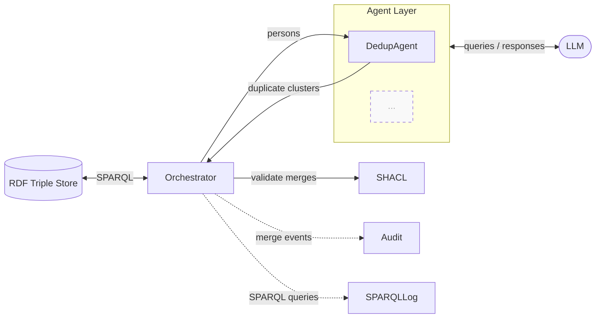

## Architecture

```mermaid
flowchart LR
    TS[(RDF Triple Store)]
    LLM([LLM])

    subgraph AL["Agent Layer"]
        DedupAgent
        Future["..."]
    end

    style Future stroke-dasharray: 5 5, fill: #f9f9f9, color: #aaa

    TS <-->|SPARQL| Orchestrator
    Orchestrator -->|persons| DedupAgent
    AL <-->|queries / responses| LLM
    DedupAgent -->|duplicate clusters| Orchestrator
    Orchestrator -->|validate merges| SHACL
    Orchestrator -.->|merge events| Audit
    Orchestrator -.->|SPARQL queries| SPARQLLog
```
