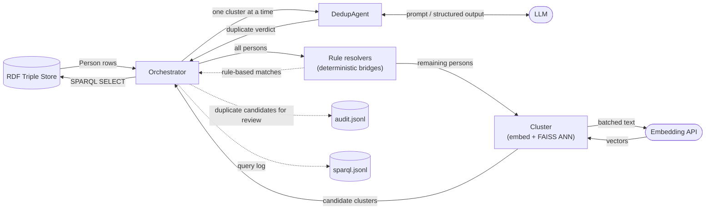

## Architecture

```mermaid
flowchart LR
    TS[(RDF Triple Store)]
    EMB([Embedding API])
    LLM([LLM])

    Orchestrator -->|SPARQL SELECT| TS
    TS -->|Person rows| Orchestrator
    Orchestrator -->|all persons| Rules["Rule resolvers\n(deterministic bridges)"]
    Rules -->|remaining persons| Cluster["Cluster\n(embed + FAISS ANN)"]
    Cluster -->|batched text| EMB
    EMB -->|vectors| Cluster
    Cluster -->|candidate clusters| Orchestrator
    Orchestrator -->|one cluster at a time| DedupAgent
    DedupAgent <-->|prompt / structured output| LLM
    DedupAgent -->|duplicate verdict| Orchestrator
    Rules -.->|rule-based matches| Orchestrator
    Orchestrator -.->|duplicate candidates for review| AuditLog[(audit.jsonl)]
    Orchestrator -.->|query log| SPARQLLog[(sparql.jsonl)]
```