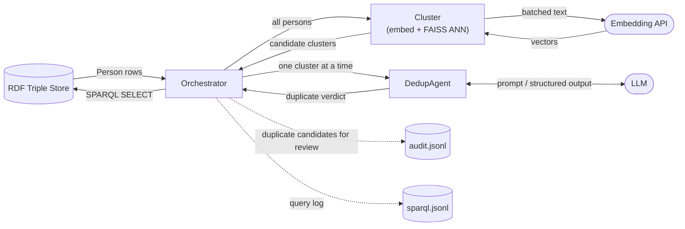

## Architecture

## Pipeline

1. **Fetch** — `KnowledgeGraphRepository.get_persons()` pulls all `schema:Person` entities from the triple store over SPARQL into `Person` models.
2. **Cluster** — `cluster_persons()` embeds each person (name + bio + location + company) via the EPFL embedding API, then groups near-duplicates with FAISS approximate nearest-neighbor search + connected components (`k` and cosine `threshold` configurable in `pyproject.toml [tool.kgent]`; defaults k=20, threshold=0.95). Singletons are dropped.
3. **Deduplicate** — for each candidate cluster, `DedupAgent` (PydanticAI + LLM) returns a single verdict for the whole cluster: `is_duplicate`, a `certainty` score, and a `reason`.
4. **Present for review** — for clusters confirmed as duplicates, the orchestrator picks the most complete record as canonical and records each canonical/duplicate pair (with confidence and reason) in `audit.jsonl` for human review. No write-back is performed — nothing is merged automatically.

Every SPARQL query is also logged to `sparql.jsonl` via `SPARQLLog`.

## Modules (`src/`)

| Module | Responsibility |
|---|---|
| `main.py` | Entry point; configures logging, calls `orchestrator.run()` |
| `orchestrator.py` | Wires everything together: fetch → cluster → dedup → present duplicates for review (audit) |
| `repository.py` | `KnowledgeGraphRepository` — `get_persons()` pulls every predicate per `schema:Person` over SPARQL into `Person` models (structured ontology fields + a full `properties` bag) |
| `models.py` | `Person` — the only entity model; structured fields mirror `pulse:PersonShape` (validation, canonical selection) plus bio/location/company for embedding and a `properties` bag holding every predicate from the graph, passed verbatim to the LLM |
| `cluster/embed.py` | Batches persons into text, calls the embedding API concurrently (httpx, retries with backoff) |
| `cluster/faiss_cluster.py` | FAISS ANN search + connected-components clustering over embeddings |
| `cluster/__init__.py` | `cluster_persons()` — public entry point combining embed + cluster |
| `agent/dedup/agent.py` | `DedupAgent` — PydanticAI agent wrapping the LLM; system prompt + `DuplicateCluster` output schema |
| `audit.py` | `AuditLog` (duplicate candidates flagged for review) and `SPARQLLog` (query history), both append-only JSONL |
| `config.py` | Loads secrets/endpoints from `.env` (SPARQL endpoint, LLM credentials) and tunable parameters from `pyproject.toml [tool.kgent]` (cluster k/threshold, embedding model/batch/concurrency) |
| `trial_real.py` | Standalone script: runs `DedupAgent` against hand-picked candidate pairs from real EPFL data for manual accuracy review |

## Status

- First successful real-data run on the june26 dataset (2026-07-17): 7,020 persons → 5,588 built, 40 candidate clusters, 6 duplicate pairs flagged for review.
- Persons whose ORCID is stored as a full URL (`https://orcid.org/…`) fail the ontology's bare-ORCID pattern and are skipped with a warning; on june26 these were all ORCID-only entities, not GitHub dedup targets.
- `Organization`, `Repository`, `Contribution`, `Membership`, `Article` models and SHACL validation (`pyshacl`, `rdflib`) were removed (2026-07-10) — unused by the Person-dedup pipeline, which only needs the flat IRI lists already on `Person`.
- SPARQL write-back (the actual merge) is intentionally deferred; the pipeline only presents candidates for review.