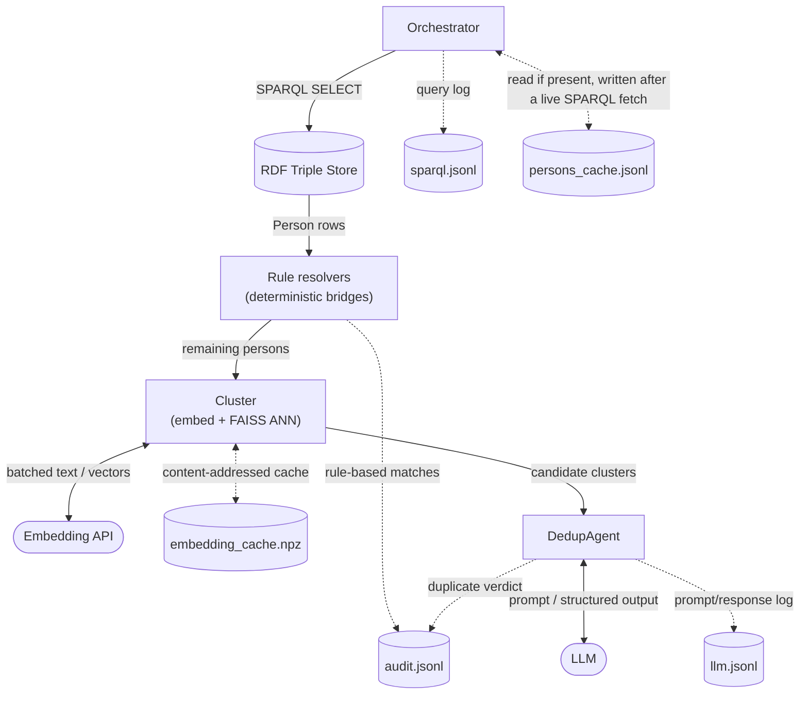

## Architecture

```mermaid
flowchart TD
    Orchestrator -->|SPARQL SELECT| TS[(RDF Triple Store)]
    Orchestrator -.->|query log| SPARQLLog[(sparql.jsonl)]
    Orchestrator <-.->|read if present, written after a live SPARQL fetch| PersonsCache[(persons_cache.jsonl)]
    TS -->|Person rows| Rules["Rule resolvers\n(deterministic bridges)"]
    Rules -.->|rule-based matches| AuditLog[(audit.jsonl)]
    Rules -->|remaining persons| Cluster["Cluster\n(embed + FAISS ANN)"]
    Cluster <-->|batched text / vectors| EMB([Embedding API])
    Cluster <-.->|content-addressed cache| EmbeddingCache[(embedding_cache.npz)]
    Cluster -->|candidate clusters| DedupAgent
    DedupAgent <-->|prompt / structured output| LLM([LLM])
    DedupAgent -.->|prompt/response log| LLMLog[(llm.jsonl)]
    DedupAgent -.->|duplicate verdict| AuditLog
```

Legend: solid arrow (`-->`) = pipeline data flow; dotted arrow (`-.->`) = persisted to / read from disk (logs, caches).