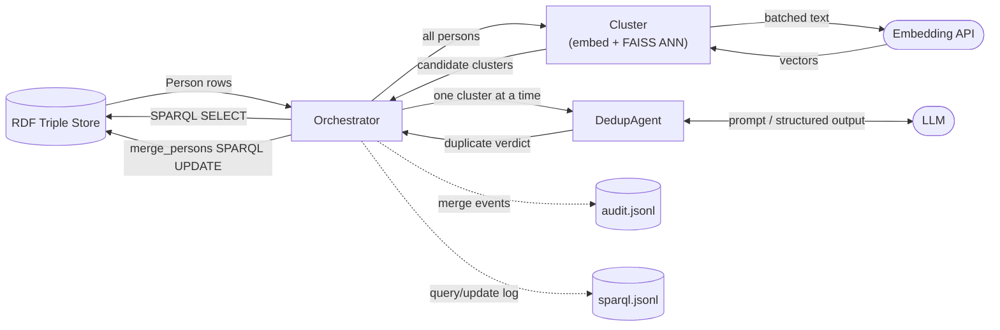

## Architecture

## Pipeline

1. **Fetch** — `KnowledgeGraphRepository.get_persons()` pulls all `schema:Person` entities from the triple store over SPARQL into `Person` models.
2. **Cluster** — `cluster_persons()` embeds each person (name + bio + location + company) via the EPFL embedding API, then groups near-duplicates with FAISS approximate nearest-neighbor search + connected components (k=20, cosine threshold=0.95). Singletons are dropped.
3. **Deduplicate** — for each candidate cluster, `DedupAgent` (PydanticAI + LLM) returns a single verdict for the whole cluster: `is_duplicate`, a `certainty` score, and a `reason`.
4. **Merge** — for clusters confirmed as duplicates, the orchestrator picks the most complete record as canonical and issues a `merge_persons()` SPARQL UPDATE (repoints all triples from the duplicate IRI to the canonical IRI), then records the merge in `audit.jsonl`.

Every SPARQL query and update is also logged to `sparql.jsonl` via `SPARQLLog`.

**Note:** merges currently happen automatically — there is no human review step before a write-back.

## Modules (`src/`)

| Module | Responsibility |
|---|---|
| `main.py` | Entry point; configures logging, calls `orchestrator.run()` |
| `orchestrator.py` | Wires everything together: fetch → cluster → dedup → merge → audit |
| `repository.py` | `KnowledgeGraphRepository` — SPARQL SELECT (`get_persons`) and UPDATE (`merge_persons`) against the triple store |
| `models.py` | `Person` — the only entity model in use; a 1:1 mapping of `pulse:PersonShape` from the ontology, plus GME enrichment fields used for embedding context only |
| `cluster/embed.py` | Batches persons into text, calls the embedding API concurrently (httpx, retries with backoff) |
| `cluster/faiss_cluster.py` | FAISS ANN search + connected-components clustering over embeddings |
| `cluster/__init__.py` | `cluster_persons()` — public entry point combining embed + cluster |
| `agent/dedup/agent.py` | `DedupAgent` — PydanticAI agent wrapping the LLM; system prompt + `DuplicateCluster` output schema |
| `audit.py` | `AuditLog` (merge history) and `SPARQLLog` (query/update history), both append-only JSONL |
| `config.py` | Loads `.env` — SPARQL endpoint, LLM/embedding credentials and model names, log paths |
| `trial_real.py` | Standalone script: runs `DedupAgent` against hand-picked candidate pairs from real EPFL data for manual accuracy review |

## Status

- Clustering + dedup pipeline has been exercised end-to-end only against synthetic data; a full run against real data (e.g. the june26 dataset) is still on the to-do list.
- `repository.get_persons()` does not yet fetch GME enrichment fields (bio/location/company) — see `trial_real.py fetch_persons()` for the query pattern to port.
- `Organization`, `Repository`, `Contribution`, `Membership`, `Article` models and SHACL validation (`pyshacl`, `rdflib`) were removed (2026-07-10) — unused by the Person-dedup pipeline, which only needs the flat IRI lists already on `Person`.
- Planned: replace auto-merge with a present-to-user review step before write-back.